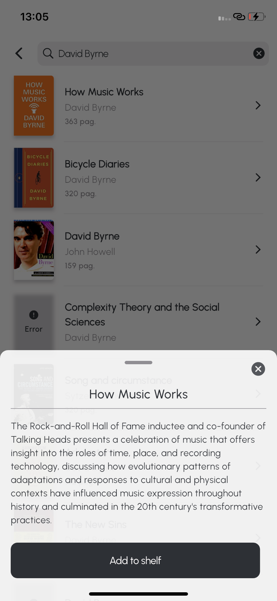
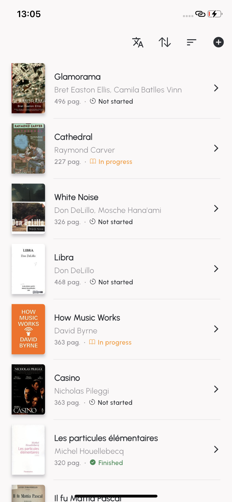
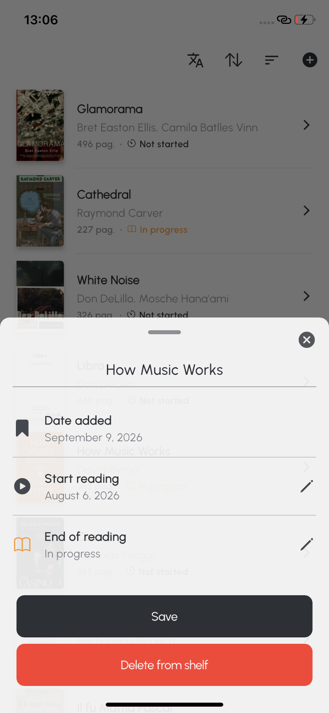
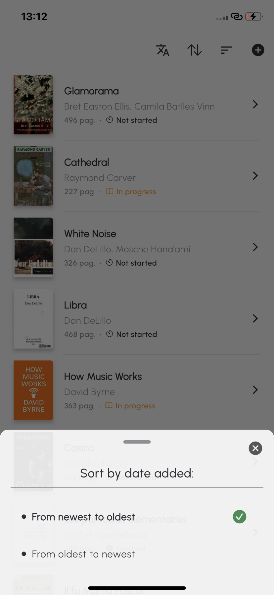
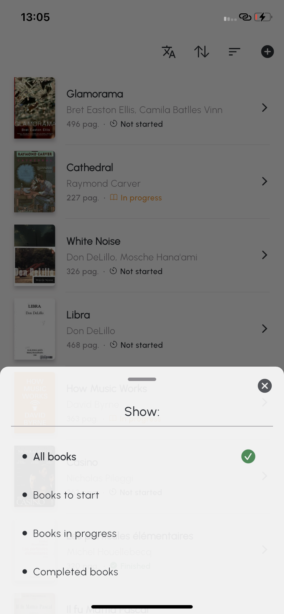
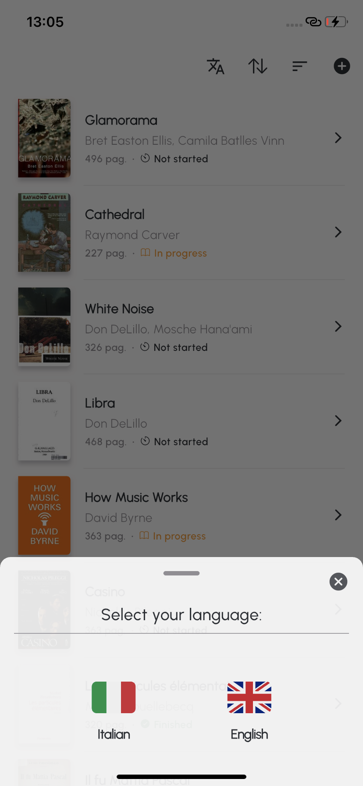

# 📚 Memento (Demo App)

**Memento** is a demo application built with **Flutter**. Its primary goal is to showcase a **Clean Architecture** built around a clear separation of layers, organized **by feature**.

The project defines abstract data sources, concrete implementations of them, and repositories that orchestrate one or more data sources.

---

## 📱 Screenshots
<p style="text-align: center;"> 
 

 
 


</p>

---

## 🛠️ Tech Stack

* **Framework:** Flutter (Dart)
* **State Management:** `flutter_bloc` — BLoC for features with more complex logic, Cubit for simpler ones
* **Routing:** `go_router` (kept intentionally simple for this demo's scope)
* **Networking:** `dio`
* **Local Storage:** `shared_preferences`
* **Localization:** Flutter's native `l10n` tooling — supports Italian and English
* **UI:** custom cross-platform widgets, `Sliver`-based layouts

---

## 📖 Features

Memento lets users build and track a personal reading list:

* **Search** — look up books directly from the *Open Library* catalog.
* **Personal library** — add books to your own shelf.
* **Reading tracking** — set a start and end date for each book, so it's easy to tell what's finished, what's in progress, and what's still unread.
* **Sorting** — order your shelf by date added, ascending or descending.
* **Filtering:** Filter your shelf by reading status (all, not started, in progress, or finished).
* **Multi-language** — full support for English and Italian, switchable from within the app.

---

## 🏗️ Architecture & Design

### Layers

Each feature follows the same Data → Domain → Presentation split:

- **`*_api` packages** (e.g. `books_api`, `shelf_api`) define an abstract interface plus the models/exceptions it works with — no concrete dependency on Dio, SharedPreferences, or any other implementation detail.
- **Concrete implementations** (e.g. `open_library_books_api`, `shared_preferences_shelf_api`) implement those interfaces against a real backend or storage mechanism.
- **Repositories** (e.g. `books_repository`) orchestrate one or more data sources and expose a single, feature-oriented API to the Presentation layer.
- **BLoCs/Cubits** consume repositories and expose UI-ready state.

This is deliberate: it keeps every layer independently testable and makes swapping an implementation detail (see [_A Note on Local Storage_](#-a-note-on-local-storage) below).

### Custom UI & Slivers

The UI relies on a custom widget system to ensure pixel-perfect rendering on both iOS and Android, promote reusability, and keep the codebase easy to maintain and test. `Sliver`-based layouts are used throughout to optimize performance and lay the groundwork for more complex scroll behaviors.

### Testing Strategy

Tests cover the parts of the code that carry real logic — **screens, BLoCs/Cubits, repositories, and data sources** — using `bloc_test`, `flutter_test`, `test` and `mocktail`. Tests for purely presentational custom widgets were intentionally left out, as they fall outside the primary scope of this architecture-focused demo.

---

## 💡 A Note on Local Storage

`shared_preferences` was chosen for local storage for its simplicity and speed of implementation. For a production app with more relational data needs, a local database such as **Drift** (or alternatives like **Hive**) would be a better fit.

Swapping the storage layer out is intentionally straightforward, thanks to the architecture described above:

1. Create a new class (e.g. `DriftShelfApi`) implementing the abstract `ShelfApi` interface.
2. Implement the concrete data handling using the chosen library.
3. Inject the new instance into `BooksRepository` via dependency injection, and provide it up the widget tree.

---

## 🚀 Getting Started

```bash
# 1. Fetch dependencies for the main app and all workspace packages
flutter pub get

# 2. Generate localization code
flutter gen-l10n

# 3. Run the app
flutter run
```

>Thanks to **Pub Workspaces**, running `flutter pub get` once from the repository root automatically resolves dependencies for the main app and all local packages under `packages/`.
---

## 📦 Project Structure

```
lib/                              # App: UI, BLoCs/Cubits,  routing, l10n, utilities, etc

packages/
  books_api/                      # Abstract interface + models for the book catalog
  open_library_books_api/         # Concrete BookApi backed by Open Library
  shelf_api/                      # Abstract interface + models for the personal library
  shared_preferences_shelf_api/   # Concrete ShelfApi backed   by SharedPreferences
  books_repository/                # Orchestrates books_api and shelf_api
  app_settings_api/                # Abstract interface for app-level settings (e.g. language)
  shared_preferences_app_settings_api/  # Concrete AppSettingsApi backed by SharedPreferences
  app_settings_repository/         # Orchestrates app_settings_api
```

---

*The codebase includes inline documentation across most classes and methods for deeper implementation context.*

---
